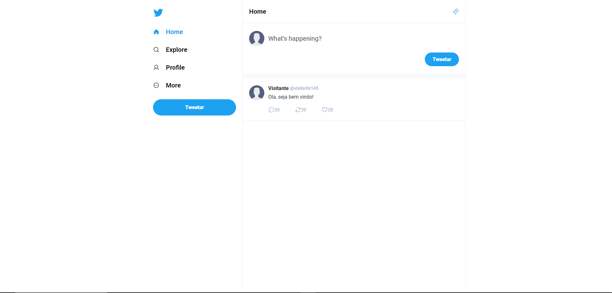

# cloneTwitter
<h1 align="center">Clone Twitter</h1>

O projeto consiste na criação de um clone do Twitter(X) utilizando React com o objetivo de replicar algumas funcionalidades da rede social. 

  <a href="#-tecnologias">Tecnologias</a>&nbsp;&nbsp;&nbsp;|&nbsp;&nbsp;&nbsp;
  <a href="#-projeto">Projeto</a>&nbsp;&nbsp;&nbsp;|&nbsp;&nbsp;&nbsp;
  <a href="#memo-licença">Licença</a>

  

 

 
    

## 🚀 Tecnologias

-Nesse projeto foi utilizado as seguintes tecnologias:

-React  
-CSS  
-React Router  
-Phosphor React  

## 💻 Projeto

O projeto consiste na criação de um clone do Twitter utilizando React sem banco de dados, por isso não tem todas as funcionalidades do Twitter(x). O principal objetivo é aprimorar minhas habilidades em React e também criar uma aplicação realista com alguma funcionalidades como:

- [Visite o projeto online]()

Esse projeto está sob a licença MIT.

---

Feito com ♥ by Helena Lima

